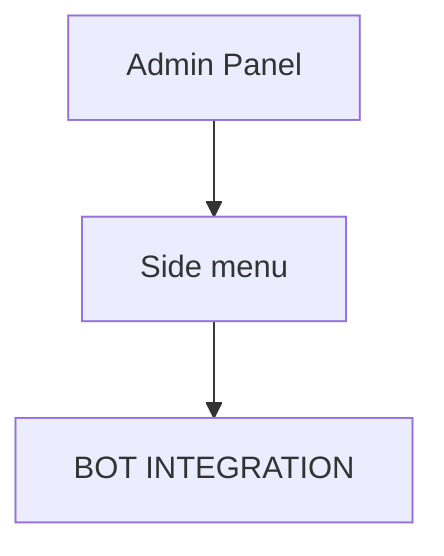
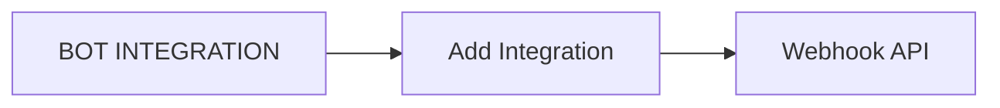
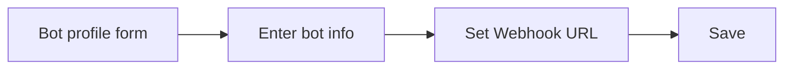
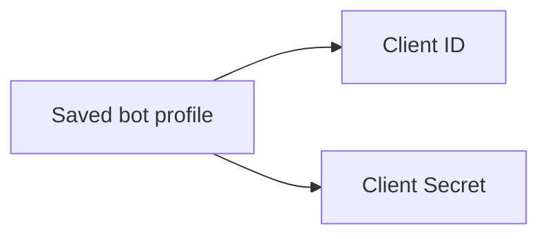

# Getting Started

The Bot API allows customers to add an external bot(s) to the Eko application. Bot connects to Eko via webhook endpoint and is authorized by OAuth2. When the bot has sent a message, the endpoint will receive a request from the Eko server once the bot has sent a message.

Bot API contains three main functionalities – user query, chat management, and message creation.

The Bot API is suitable for making a one-way communication bot such as bot for sending notification or alert. Also, an interactive bot that can communicate with users

## Getting API Key

To use the Bot API you must have an API key. The API key is a unique identifier that is used to authenticate requests. To get an API key:

1. Create Bot profile
2. Generate Access token by OAuth.
3. Add access token in the request

## Create Bot Profile

To implement bot on Eko, The developer has to create bot profile on Admin Panel.&#x20;

Navigate to "BOT INTEGRATION" on side menu.

> Screenshot replacement: Admin Panel side menu with **BOT INTEGRATION** selected.




Click "Add Integration" and "Webhook API"

> Screenshot replacement: Bot Integration page showing **Add Integration** and **Webhook API**.




Fill in bot information including Webhook URL then, click "Save".

> Screenshot replacement: Bot profile form where the bot name and webhook URL are entered, then saved.




Once the bot is created, the client id and client secret of the bot will be generated.

> Screenshot replacement: Created bot profile page showing generated **client_id** and **client_secret**.




## Bot Authorization

**After created a bot profile, you’ll also need to provide a random string generated from Admin Panel to use for OAuth service. After the authentication succeeds an access token will be provided.**

On node.JS, the authentication algorithm looks like this

```
const ClientOAuth2 = require('client-oauth2');

const ekoAuth = new ClientOAuth2({
  clientId: process.env.EKO_OAUTH_CLIENT_ID,
  clientSecret: process.env.EKO_OAUTH_CLIENT_SECRET,
  accessTokenUri: `${process.env.EKO_HTTP_URI}/oauth/token`, //Eko HTTP server uri
  scopes: ['bot'],
});

const authenticate = async () => {
  const { data } = await ekoAuth.credentials.getToken();
  app.set('token', data); //returned access token
};
```

#### OAuth Parameter

| Name           | Type   | Description                   |
| -------------- | ------ | ----------------------------- |
| clientId       | String | Random string specific to bot |
| clientSecret   | String | Random string specific to bot |
| accessTokenUri | String | Eko http server uri           |

After the authentication succeeds, Please follow the below step


The *access token* will be generated when the bot is successfully authorized.


#### Add the access token to your request

You must include an access token with every API request. In the following example, replace `ekoAPIKey` with the access token.

```
headers: {
        Authorization: `Bearer ${ekoAPIKey}`,
      },
```
