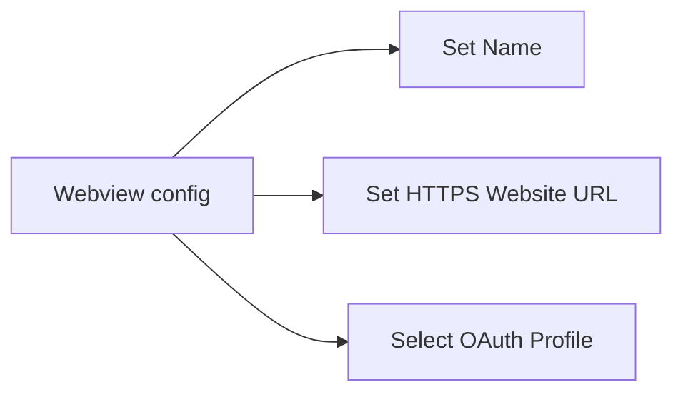
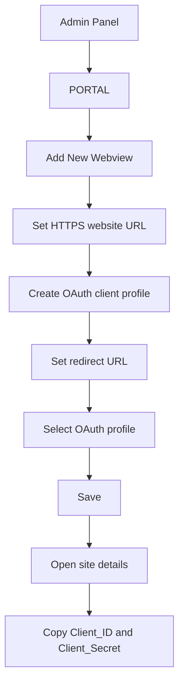

# Register WebApp

To use Eko as an identity provider, the third party app must first register to Eko to get client\_id and client\_secret. Client\_id and client\_secret are the credentials used by a third party app to authenticate itself to Eko Auth.

To register, please log on to Admin panel

> Screenshot replacement: Admin Panel login page.

Once you logged on, click on "**PORTAL**" button.

> Screenshot replacement: Admin Panel **PORTAL** button.

You will see a list of your third party applications. Click on "**Add New Webview**" to create a new site.

> Screenshot replacement: Third-party applications list with **Add New Webview**.

You can define Name and Website url of third party web application in this page. We support only **HTTPS** sites. click on "**Select OAuth profile**" to generate the keys.

> Screenshot replacement: Webview configuration page with app name, HTTPS website URL, and **Select OAuth Profile**.

click on "**Add new oAuth client profile**" to create a new OAuth profile.

> Screenshot replacement: OAuth profile selector with **Add new oAuth client profile**.

Put you app name and redirect url. The redirect url must be the same as the website url.

> Screenshot replacement: New OAuth profile form where app name and redirect URL are entered.

Once you have created the OAuth profile for the app, click on "**Select OAuth Profile**" again.

> Screenshot replacement: Return to the webview configuration page and open **Select OAuth Profile** again.

Select the OAuth Profile you just created.

> Screenshot replacement: OAuth profile selection list showing the profile just created.

You can see that the OAuth profile will be shown under Authentication section. click "**Save**"

> Screenshot replacement: Authentication section now shows the selected OAuth profile; click **Save**.

Click on the site again.

> Screenshot replacement: Saved webview/site list; click the site again to view credentials.

You will see the Client\_ID and Client\_Secret that can be used for authentication.

> Screenshot replacement: Webview detail page showing generated **Client_ID** and **Client_Secret**.

