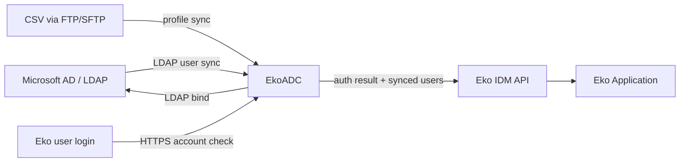

# AD Integration

## Active Directory Connector

Eko’s active directory connector (EkoADC) is Eko’s proprietary software used for user synchronization and authentication which works with Microsoft Active Directory or other LDAP compatible identity management systems. EkoADC runs on a secure hardened Ubuntu image that can be installed both ​on-premise​ or ​on the cloud​.

> Diagram replacement: EkoADC synchronizes users and authenticates logins against LDAP-compatible identity systems.




EkoADC is mainly responsible for two main tasks; user synchronization and user authentication.

## EkoADC User Synchronization

EkoADC can be configured to talk with user directory via Lightweight Directory Access Protocol (LDAP) to fetch user data from customer’s directory service such as Microsoft Active Directory so that all accounts in user directory can be used with Eko Application.

EkoADC also supports user synchronization from Comma Separated Value (CSV) file via FTP/SFTP in case user profiles are stored in another database. However, each line in CSV file must contain user account (user ID) that can be used for mapping user account and LDAP binding.

Note: User synchronization from file should be used for user profile synchronization only. Directory software that supports LDAP is still required for user authentication.

## EkoADC User Authentication

When a user logs into Eko by entering user account, user account information is passed to EkoADC via HTTPS. Upon receiving user account, EkoADC will perform LDAP binding for authentication. If authenticated successfully, EkoADC send back result to EkoIDMAPI

## EkoADC Server Specification

CPU: >=4 Cores\
&#x20;Memory: >=4 GB\
&#x20;Disk: >=100 GB\
&#x20;Network: >= 1Gb Ethernet with NAT\
&#x20;OS Support : Ubuntu 20.04 LTS&#x20;


Virtual Machine and OS provide by Customer, The Application provided by Eko Communications


## Access Control for EkoADC

Eko ADC supported to synchronize employee directly from Active Directory or synchronize in CSV file format from customer’s file sharing (for this mode customer need to add AD’s user into the file for authentication purpose). Before start to install, customer need to pre-define the network access control as following

| Source        | Destination   | Port                   |
| ------------- | ------------- | ---------------------- |
| EkoADC        | Internet(Any) | TCP/443                |
| Internet(Any) | EkoADC        | TCP/443                |
| EkoADC        | Customer AD   | LDAP, LDAPs            |
| EkoADC        | Time server   | NTP (TCP/123, UDP/123) |
| EkoADC        | DNS server    | DNS (UDP/53)           |
| EkoADC        | FTP server    | TCP/FTP, TCP/FTPs      |

## Installation preparation

* EkoADC component base on container services and the OS can running on both VM and Physical machine.
* Customer need in pre-install the OS and software component as following
  * Ubuntu OS (We recommended to running on Ubuntu 20.04 LTS) and updated

    with latest security patch/hotfix.
  * Docker CE (Installation Instruction: <https://docs.docker.com/install/linux/docker-ce/ubuntu/>)
  * Docker Compose utility (Installation instruction: <https://docs.docker.com/compose/install/>​)

## Installation instruction

* EkoADC need to install on secure infrastructure and harden OS with latest security patch.
* Login to Ubuntu OS with non root privilege
* Create .​/app​ with ​“mkdir app”
* Go to the directory ​./app​ and create file docker-compose.yaml, .env, config.json and copy starting configuration to the files.
* Pull EkoADC Container with wget command:

```
$wget h​ ttps://s3-ap-southeast-1.amazonaws.com/eko-docker-images/eko-adc/eko-adc-1.0.xx.tar
```

* Load docker container to docker engine with docker command:

```
$docker load -i eko-adc-1.0.xx.tar
```

* Start the EkoADC container with docker-compose command

```
$docker-compose up -d
```

* EkoADC will starting and you can access to the EkoADC web console from server ip with https protocol. That’s finished to install the EkoADC

The starting configurations include:

#### ​docker-compose.yaml

```
version: '2'
services:
  ekoadc:
    image: 826057481178.dkr.ecr.ap-southeast-1.amazonaws.com/eko-adc:${EKO_ADC_VERSION}
    restart: always
    command: npm start
    volumes:
      - ./config.json:/app/config.json
      - ./logs:/app/logs
      - ./img:/tmp/img/
    ports:
      - 443:3014
    logging:
      driver: json-file
      options:
        max-size: 5m
        max-file: '5'
```

#### .env

```
EKO_ADC_VERSION=1​ .0.10
```

#### config.json

```
{
  "ldap_server": {
    "ip_address": "ldapserver.ekoapp.com",
    "protocol": "ldap",
    "port": 389,
    "type": "AD",
    "login_pattern": "",
    "ldap_username": "admin@ekoapp.com",
    "ldap_password": "",
    "base_dn": "ou=bkk_users,dc=ekoapp,dc=com",
    "group_dn": "",
    "filter": "(objectclass=user)",
    "attributes": [
      "mail",
      "userPrincipalName",
      "dn"
    ],
    "usersearchLimit": 10000
  },
  "file_server": {
    "host": "ftp.ekoapp.com",
    "protocol": "ftp",
    "port": 21,
    "username": "test",
    "password": "6056ec6c8589d9",
    "enable_user_file_path": "file/users.csv",
    "disable_user_file_path": "",
    "separator": "#",
    "skip_first_line": false
  },
  "image_sync": {
    "enable_avatar_update": false,
    "avatar_file_path": "/avatar/%{network_uid}.jpg",
    "avatar_file_name": "{%network_uid}-avatar",
    "avatar_file_ext": "jpg",
    "avatar_force_all": false,
    "avatar_check_date": true
  },
  "eko_idmapi": {
    "ip_address": "https://ekogreen-idmapi.ekoapp.com/api/v1",
    "secret_token": "testtoken",
    "apikey": "testapikey",
    "ad_domain": "ekoapp.com"
  },
  "eko_adc": {
    "app_port": 3014,
    "username": "eko",
    "password": "$2a$10$YjtnDW8cLsKpdUUizaMtsOsKmucx04tZeSHbuvVN8ir6rcRm7VDO2",
    "auditor": "auditor",
    "auditor_password": "$2a$10$wwiilDrC/ntUbmkmrBDRNe6SAuisXuRsR8WhlNvcbN0SHRe5aQDEy",
    "operator": "operator",
    "operator_password": "$2a$04$PQkASJQA9OalchS8tn8jw.k6WHDPMLtdO2Ckb.0cuYqvSxrJGyHjW",
    "time_offset": 7,
    "log_dir": "logs",
    "data_source": "file",
    "secure": true,
    "sync_interval": 3600000,
    "sync_daily_times": [],
    "last_sync": 0,
    "app_description": "Eko's ADC",
    "enable_force_delete": true,
    "enable_force_disable": false
  },
  "proxy": {
    "protocol": "http",
    "username": "proxy",
    "host": "proxy.ekoapp.com",
    "port": 3128,
    "enable": true,
    "password": "685ced6c8389"
  },
  "attribute_parser": {
    "sha1_attributes": []
  },
  "alert" : {
    "mail_list": [],
    "mail_enabled": false,
    "msg_uri": [
      "https://ekogreen-api.ekoapp.com/v0"
    ],
    "msg_enabled": false,
    "msg_info": [
      {
        "endpoint": "https://ekogreen-api.ekoapp.com/v0",
        "gateway_key": "",
        "api_key": "",
        "multi_group_enabled": false,
        "groups": []
      }
    ]
  }
}
```

## Upgrade instruction

* Pull the latest version of EkoADC Container with wget command:&#x20;

```
$wget h​ttps://s3-ap-southeast-1.amazonaws.com/eko-docker-images/eko-adc/eko-adc-1.1.xx.tar
```

* Load docker container to docker engine with docker command:

```
$docker load -i eko-adc-1.1.xx.tar
```

* Update file “​.env”​ file with latest version of EkoADC

```
EKO_ADC_VERSION=​1.1.xx
```

* Start the EkoADC container with docker-compose command

```
$docker-compose up -d
```

* Login to Web Console to update the configuration
