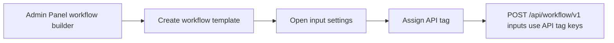

# Create Workflow

To use workflow creation API, admin need to create a workflow template on admin panel. Once the workflow template is created, the workflow template ID will be shown on admin panel. The developers can use the workflow template ID to create workflow in Eko by using workflow creation API.

Admin should specify API tag in each input. API tag will be use for inserting appropriate data or tracking. Admin can specify API tag for each input under setting section in workflow builder.

> Screenshot replacement: Workflow builder input settings where an API tag is assigned to an input.




The developers can put appropriate data in input with the request. The data can be insert at Start stage only.&#x20;

## Create a workflow

<mark style="color:green;">`POST`</mark> `https://customer-h1.ekoapp.com/api/workflow/v1`

#### Headers

| Name          | Type   | Description                           |
| ------------- | ------ | ------------------------------------- |
| Authorization | string | The access token generated from OAuth |
| Content-Type  | string | application/json                      |

#### Request Body

| Name       | Type   | Description                                           |
| ---------- | ------ | ----------------------------------------------------- |
| sender     | string | Username of sender                                    |
| templateId | string | Workflow template id                                  |
| priority   | string | Priority of workflow: High, Medium, Low               |
| dueDate    | string | Workflow due date; 'YYYY-MM-DD' or 'YYYY-MM-DDTHH:mm' |
| inputs     | array  | An array of apiTag(input)                             |




```
{
  "refId": 100,
  "title": "Title",
  "createdAt": "2019-09-15T07:02:45.665Z",
  "template": {
      "id": "5d7f59852e7ad5360a000000",
      "name": "Test API Creation"
  },
  "sender": "sender@ekoapp.com"
}

```




Parameter: input is an array of api tag. You can define each tag for each input in workflow builder in admin panel. There are several input types in workflow. You can see example of each input type below:&#x20;

```
#example command for creating a workflow.

curl -X POST \
  https://customer-h1.ekoapp.com/api/workflow/v1 \
  -H 'Content-Type: application/json' \
  -H 'Autorization: Bearer 53a0295873d08e6bd21a9c8f27d0f13acba5d62f' \
  -d '{
  "sender": "sender@ekoapp.com",
  "templateId": "5d7f59852e7ad5360a000000",
  "inputs": {
    "text": "This is an example of text input",
    "textArea": "This is an example of text area input",
    "singleUser": "user01@ekoapp.com",
    "multiUsers": [
      "user02@ekoapp.com",
      "user03@ekoapp.com"
    ],
    "number": 99, #This is an example of number input
    "yesNo": true, #This is an example of yes/no input
    "singleChoice": "1", #This is an example of single choice input
    "multiChoice": [
      "0","1"
    ], #This is an example of multiple choice input
    "dateTime": "2019-09-24T05:00", #This is an example of date time input
    "time": {
      "hours": 12,
      "minutes": 0,
      "seconds": 0
    } #This is an example of time input
    }
}
```
